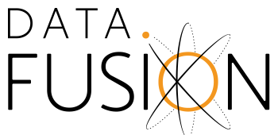

<!---
  Licensed to the Apache Software Foundation (ASF) under one
  or more contributor license agreements.  See the NOTICE file
  distributed with this work for additional information
  regarding copyright ownership.  The ASF licenses this file
  to you under the Apache License, Version 2.0 (the
  "License"); you may not use this file except in compliance
  with the License.  You may obtain a copy of the License at

    http://www.apache.org/licenses/LICENSE-2.0

  Unless required by applicable law or agreed to in writing,
  software distributed under the License is distributed on an
  "AS IS" BASIS, WITHOUT WARRANTIES OR CONDITIONS OF ANY
  KIND, either express or implied.  See the License for the
  specific language governing permissions and limitations
  under the License.
-->

# DataFusion



DataFusion is an extensible query execution framework, written in
Rust, that uses [Apache Arrow](https://arrow.apache.org) as its
in-memory format.

DataFusion supports both an SQL and a DataFrame API for building
logical query plans as well as a query optimizer and execution engine
capable of parallel execution against partitioned data sources (CSV
and Parquet) using threads.

DataFusion also supports distributed query execution via the
[Ballista](ballista/README.md) crate.

## Use Cases

DataFusion is used to create modern, fast and efficient data
pipelines, ETL processes, and database systems, which need the
performance of Rust and Apache Arrow and want to provide their users
the convenience of an SQL interface or a DataFrame API.

## Why DataFusion?

- _High Performance_: Leveraging Rust and Arrow's memory model, DataFusion achieves very high performance
- _Easy to Connect_: Being part of the Apache Arrow ecosystem (Arrow, Parquet and Flight), DataFusion works well with the rest of the big data ecosystem
- _Easy to Embed_: Allowing extension at almost any point in its design, DataFusion can be tailored for your specific usecase
- _High Quality_: Extensively tested, both by itself and with the rest of the Arrow ecosystem, DataFusion can be used as the foundation for production systems.

## Known Uses

Here are some of the projects known to use DataFusion:

- [Ballista](ballista) Distributed Compute Platform
- [Cloudfuse Buzz](https://github.com/cloudfuse-io/buzz-rust)
- [Cube Store](https://github.com/cube-js/cube.js/tree/master/rust)
- [datafusion-python](https://pypi.org/project/datafusion)
- [datafusion-java](https://github.com/datafusion-contrib/datafusion-java)
- [datafusion-ruby](https://github.com/j-a-m-l/datafusion-ruby)
- [delta-rs](https://github.com/delta-io/delta-rs)
- [InfluxDB IOx](https://github.com/influxdata/influxdb_iox) Time Series Database
- [ROAPI](https://github.com/roapi/roapi)
- [Tensorbase](https://github.com/tensorbase/tensorbase)
- [Squirtle](https://github.com/DSLAM-UMD/Squirtle)

(if you know of another project, please submit a PR to add a link!)

## Example Usage

Run a SQL query against data stored in a CSV:

```rust
use datafusion::prelude::*;
use datafusion::arrow::util::pretty::print_batches;
use datafusion::arrow::record_batch::RecordBatch;

#[tokio::main]
async fn main() -> datafusion::error::Result<()> {
  // register the table
  let mut ctx = ExecutionContext::new();
  ctx.register_csv("example", "tests/example.csv", CsvReadOptions::new()).await?;

  // create a plan to run a SQL query
  let df = ctx.sql("SELECT a, MIN(b) FROM example GROUP BY a LIMIT 100").await?;

  // execute and print results
  df.show().await?;
  Ok(())
}
```

Use the DataFrame API to process data stored in a CSV:

```rust
use datafusion::prelude::*;
use datafusion::arrow::util::pretty::print_batches;
use datafusion::arrow::record_batch::RecordBatch;

#[tokio::main]
async fn main() -> datafusion::error::Result<()> {
  // create the dataframe
  let mut ctx = ExecutionContext::new();
  let df = ctx.read_csv("tests/example.csv", CsvReadOptions::new()).await?;

  let df = df.filter(col("a").lt_eq(col("b")))?
          .aggregate(vec![col("a")], vec![min(col("b"))])?;

  // execute and print results
  df.show_limit(100).await?;
  Ok(())
}
```

Both of these examples will produce

```text
+---+--------+
| a | MIN(b) |
+---+--------+
| 1 | 2      |
+---+--------+
```

## Using DataFusion as a library

DataFusion is [published on crates.io](https://crates.io/crates/datafusion), and is [well documented on docs.rs](https://docs.rs/datafusion/).

To get started, add the following to your `Cargo.toml` file:

```toml
[dependencies]
datafusion = "6.0.0"
```

## Using DataFusion as a binary

DataFusion also includes a simple command-line interactive SQL utility. See the [CLI reference](https://arrow.apache.org/datafusion/cli/index.html) for more information.

# Status

## General

- [x] SQL Parser
- [x] SQL Query Planner
- [x] Query Optimizer
- [x] Constant folding
- [x] Join Reordering
- [x] Limit Pushdown
- [x] Projection push down
- [x] Predicate push down
- [x] Type coercion
- [x] Parallel query execution

## SQL Support

- [x] Projection
- [x] Filter (WHERE)
- [x] Filter post-aggregate (HAVING)
- [x] Limit
- [x] Aggregate
- [x] Common math functions
- [x] cast
- [x] try_cast
- [x] [`VALUES` lists](https://www.postgresql.org/docs/current/queries-values.html)
- Postgres compatible String functions
  - [x] ascii
  - [x] bit_length
  - [x] btrim
  - [x] char_length
  - [x] character_length
  - [x] chr
  - [x] concat
  - [x] concat_ws
  - [x] initcap
  - [x] left
  - [x] length
  - [x] lpad
  - [x] ltrim
  - [x] octet_length
  - [x] regexp_replace
  - [x] repeat
  - [x] replace
  - [x] reverse
  - [x] right
  - [x] rpad
  - [x] rtrim
  - [x] split_part
  - [x] starts_with
  - [x] strpos
  - [x] substr
  - [x] to_hex
  - [x] translate
  - [x] trim
- Miscellaneous/Boolean functions
  - [x] nullif
- Approximation functions
  - [x] approx_distinct
- Common date/time functions
  - [ ] Basic date functions
  - [ ] Basic time functions
  - [x] Basic timestamp functions
    - [x] [to_timestamp](docs/user-guide/book/sql/datafusion-functions.html#to_timestamp)
    - [x] [to_timestamp_millis](docs/user-guide/book/sql/datafusion-functions.html#to_timestamp_millis)
    - [x] [to_timestamp_micros](docs/user-guide/book/sql/datafusion-functions.html#to_timestamp_micros)
    - [x] [to_timestamp_seconds](docs/user-guide/book/sql/datafusion-functions.html#to_timestamp_seconds)
- nested functions
  - [x] Array of columns
- [x] Schema Queries
  - [x] SHOW TABLES
  - [x] SHOW COLUMNS
  - [x] information_schema.{tables, columns}
  - [ ] information_schema other views
- [x] Sorting
- [ ] Nested types
- [ ] Lists
- [x] Subqueries
- [x] Common table expressions
- [x] Set Operations
  - [x] UNION ALL
  - [x] UNION
  - [x] INTERSECT
  - [x] INTERSECT ALL
  - [x] EXCEPT
  - [x] EXCEPT ALL
- [x] Joins
  - [x] INNER JOIN
  - [x] LEFT JOIN
  - [x] RIGHT JOIN
  - [x] FULL JOIN
  - [x] CROSS JOIN
- [ ] Window
  - [x] Empty window
  - [x] Common window functions
  - [x] Window with PARTITION BY clause
  - [x] Window with ORDER BY clause
  - [ ] Window with FILTER clause
  - [ ] [Window with custom WINDOW FRAME](https://github.com/apache/arrow-datafusion/issues/361)
  - [ ] UDF and UDAF for window functions

## Data Sources

- [x] CSV
- [x] Parquet primitive types
- [ ] Parquet nested types

## Extensibility

DataFusion is designed to be extensible at all points. To that end, you can provide your own custom:

- [x] User Defined Functions (UDFs)
- [x] User Defined Aggregate Functions (UDAFs)
- [x] User Defined Table Source (`TableProvider`) for tables
- [x] User Defined `Optimizer` passes (plan rewrites)
- [x] User Defined `LogicalPlan` nodes
- [x] User Defined `ExecutionPlan` nodes

## Rust Version Compatbility

This crate is tested with the latest stable version of Rust. We do not currrently test against other, older versions of the Rust compiler.

# Supported SQL

This library currently supports many SQL constructs, including

- `CREATE EXTERNAL TABLE X STORED AS PARQUET LOCATION '...';` to register a table's locations
- `SELECT ... FROM ...` together with any expression
- `ALIAS` to name an expression
- `CAST` to change types, including e.g. `Timestamp(Nanosecond, None)`
- most mathematical unary and binary expressions such as `+`, `/`, `sqrt`, `tan`, `>=`.
- `WHERE` to filter
- `GROUP BY` together with one of the following aggregations: `MIN`, `MAX`, `COUNT`, `SUM`, `AVG`
- `ORDER BY` together with an expression and optional `ASC` or `DESC` and also optional `NULLS FIRST` or `NULLS LAST`

## Supported Functions

DataFusion strives to implement a subset of the [PostgreSQL SQL dialect](https://www.postgresql.org/docs/current/functions.html) where possible. We explicitly choose a single dialect to maximize interoperability with other tools and allow reuse of the PostgreSQL documents and tutorials as much as possible.

Currently, only a subset of the PostgreSQL dialect is implemented, and we will document any deviations.

## Schema Metadata / Information Schema Support

DataFusion supports the showing metadata about the tables available. This information can be accessed using the views of the ISO SQL `information_schema` schema or the DataFusion specific `SHOW TABLES` and `SHOW COLUMNS` commands.

More information can be found in the [Postgres docs](https://www.postgresql.org/docs/13/infoschema-schema.html)).

To show tables available for use in DataFusion, use the `SHOW TABLES` command or the `information_schema.tables` view:

```sql
> show tables;
+---------------+--------------------+------------+------------+
| table_catalog | table_schema       | table_name | table_type |
+---------------+--------------------+------------+------------+
| datafusion    | public             | t          | BASE TABLE |
| datafusion    | information_schema | tables     | VIEW       |
+---------------+--------------------+------------+------------+

> select * from information_schema.tables;

+---------------+--------------------+------------+--------------+
| table_catalog | table_schema       | table_name | table_type   |
+---------------+--------------------+------------+--------------+
| datafusion    | public             | t          | BASE TABLE   |
| datafusion    | information_schema | TABLES     | SYSTEM TABLE |
+---------------+--------------------+------------+--------------+
```

To show the schema of a table in DataFusion, use the `SHOW COLUMNS` command or the or `information_schema.columns` view:

```sql
> show columns from t;
+---------------+--------------+------------+-------------+-----------+-------------+
| table_catalog | table_schema | table_name | column_name | data_type | is_nullable |
+---------------+--------------+------------+-------------+-----------+-------------+
| datafusion    | public       | t          | a           | Int32     | NO          |
| datafusion    | public       | t          | b           | Utf8      | NO          |
| datafusion    | public       | t          | c           | Float32   | NO          |
+---------------+--------------+------------+-------------+-----------+-------------+

>   select table_name, column_name, ordinal_position, is_nullable, data_type from information_schema.columns;
+------------+-------------+------------------+-------------+-----------+
| table_name | column_name | ordinal_position | is_nullable | data_type |
+------------+-------------+------------------+-------------+-----------+
| t          | a           | 0                | NO          | Int32     |
| t          | b           | 1                | NO          | Utf8      |
| t          | c           | 2                | NO          | Float32   |
+------------+-------------+------------------+-------------+-----------+
```

## Supported Data Types

DataFusion uses Arrow, and thus the Arrow type system, for query
execution. The SQL types from
[sqlparser-rs](https://github.com/ballista-compute/sqlparser-rs/blob/main/src/ast/data_type.rs#L57)
are mapped to Arrow types according to the following table

| SQL Data Type | Arrow DataType                    |
| ------------- | --------------------------------- |
| `CHAR`        | `Utf8`                            |
| `VARCHAR`     | `Utf8`                            |
| `UUID`        | _Not yet supported_               |
| `CLOB`        | _Not yet supported_               |
| `BINARY`      | _Not yet supported_               |
| `VARBINARY`   | _Not yet supported_               |
| `DECIMAL`     | `Float64`                         |
| `FLOAT`       | `Float32`                         |
| `SMALLINT`    | `Int16`                           |
| `INT`         | `Int32`                           |
| `BIGINT`      | `Int64`                           |
| `REAL`        | `Float32`                         |
| `DOUBLE`      | `Float64`                         |
| `BOOLEAN`     | `Boolean`                         |
| `DATE`        | `Date32`                          |
| `TIME`        | `Time64(TimeUnit::Millisecond)`   |
| `TIMESTAMP`   | `Timestamp(TimeUnit::Nanosecond)` |
| `INTERVAL`    | _Not yet supported_               |
| `REGCLASS`    | _Not yet supported_               |
| `TEXT`        | _Not yet supported_               |
| `BYTEA`       | _Not yet supported_               |
| `CUSTOM`      | _Not yet supported_               |
| `ARRAY`       | _Not yet supported_               |

# Roadmap

Please see [Roadmap](docs/source/specification/roadmap.md) for information of where the project is headed.

# Architecture Overview

There is no formal document describing DataFusion's architecture yet, but the following presentations offer a good overview of its different components and how they interact together.

- (March 2021): The DataFusion architecture is described in _Query Engine Design and the Rust-Based DataFusion in Apache Arrow_: [recording](https://www.youtube.com/watch?v=K6eCAVEk4kU) (DataFusion content starts [~ 15 minutes in](https://www.youtube.com/watch?v=K6eCAVEk4kU&t=875s)) and [slides](https://www.slideshare.net/influxdata/influxdb-iox-tech-talks-query-engine-design-and-the-rustbased-datafusion-in-apache-arrow-244161934)
- (Feburary 2021): How DataFusion is used within the Ballista Project is described in \*Ballista: Distributed Compute with Rust and Apache Arrow: [recording](https://www.youtube.com/watch?v=ZZHQaOap9pQ)

# Developer's guide

Please see [Developers Guide](DEVELOPERS.md) for information about developing DataFusion.
