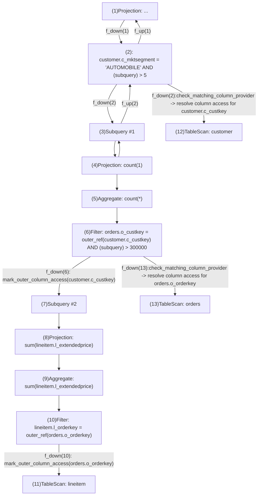
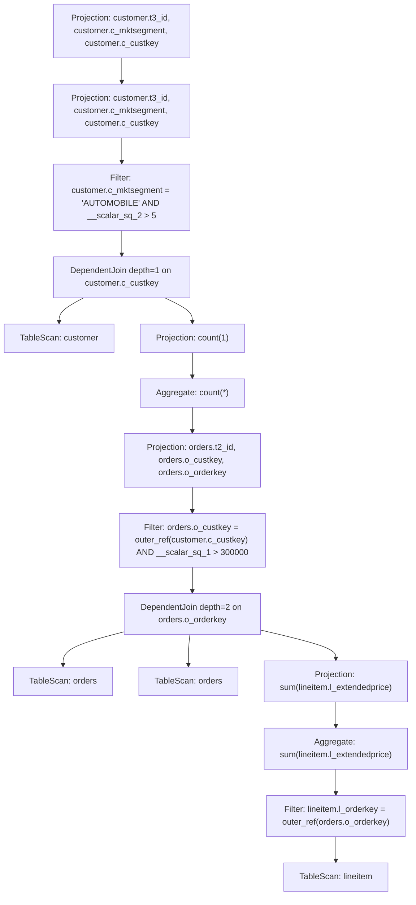

## Which issue does this PR close?

https://github.com/apache/datafusion/issues/16059 has completed, but the result is not persisted into datafusion.

=> This PR brings back all the changes inside the GSOC work and a complete POC.

I'll try to break it down into smaller components and bring them into datafusion:

## Prerequisite

- logical/physical operator for delimget
- left singlejoin support

## Major part
- implement DependentJoinRewriter <- This PR
- implement DependentJoinDecorrelator 
- implement Deliminator

<!--
We generally require a GitHub issue to be filed for all bug fixes and enhancements and this helps us generate change logs for our releases. You can link an issue to this PR using the GitHub syntax. For example `Closes #123` indicates that this PR will close issue #123.
-->


## Rationale for this change

### DependentJoin
As per paper 2
> We split the algorithm into three parts: First, a preparatory phase that identifies all non-trivial
dependent joins and annotates them with information that the main algorithm needs. Second,
the logic to eliminate dependent joins, which will be called for all non-trivial dependent
joins in top-to-bottom order and which is the main algorithm, and third, the unnesting rules
for individual operators. Note that we do not include a formalization of this approach due to
space constraints, formal definitions and a proof of correctness can be found in a technical
report [Ne24].

There is a need to detect non-trivial dependent join (i.e dependent joins where the RHS accesses columns provided by the LHS) and annotate metadata before decorrelation begins.
The paper suggest the usage of index algebra, however, for now we go forward without such data structure

"Using an indexed algebra is ideal for this phase because it can do every LCA computation in 𝑂(log 𝑛) without any additional data structures. If the DBMS does not support that functionality, the same information can be computed with worse asymptotic complexity by keeping track of the column sets that are available in the different parts of the tree."

Given this query

```
SELECT *
FROM customer
WHERE c_mktsegment='AUTOMOBILE' AND
    (SELECT COUNT(*) FROM orders
        WHERE o_custkey=c_custkey AND
            (SELECT SUM(l_extendedprice) FROM lineitem
                WHERE l_orderkey=o_orderkey
            )>300000
    )>5
```

According to the paper, this query is constructed into this trees with some additional annotations


"we consider every column access and compute the lowest common ancestor (LCA) of the operator o1 that accesses the column and the operator o2 that provides the column. If the LCA is not o1 , it must be a dependent join 3 and we annotate 3 with the fact that o1 is accessing the left-hand side of 3"
Explanation:
- Node9 is a filter with expr `T3.a=T1.a`, with T1.a is a column provided by some operator/relation outside its current context (in Datafusion we call them OuterRefColumn). Now we need to annotate this access with extra information:
    - Where should the dependent join node for this access be (i.e Node5, Node4 or Node1) 
    - Let's say we already detect D is the dependent join node, 
then which descendant of this node "provides" the column T1.a. In this case Node2 (not Node3) is the provider of column T1.a

We introduce a new struct in Datafusion to contain these annotations

```rust
pub struct CorrelatedColumnInfo {
    pub col: Column,
    // TODO: is data_type necessary?
    pub field: FieldRef,
    pub depth: usize,
    // the reference to the delim scan node map
    // this is useful to construct delim scan operator later
    pub delim_scan_node_id: usize,
}
```

> To implement this annotation similar to the paper, in Datafusion we use the tree traversal API on the root `LogicalPlan` node, specifically method `rewrite_with_subqueries`. This method ensure all the RHS of any potential dependent join node are visited first 

```
macro_rules! handle_transform_recursion {
    ($F_DOWN:expr, $F_CHILD:expr, $F_UP:expr) => {{
        $F_DOWN?
            .transform_children(|n| {
                n.map_subqueries($F_CHILD)?
                    .transform_sibling(|n| n.map_children($F_CHILD))
            })?
            .transform_parent($F_UP)
    }};
}
```


The goal of this traversal is to link between the accessor and the providers. There will be intermediate state persisted during the traversal
```rust
pub struct DependentJoinRewriter {
    // each logical plan traversal will assign it a integer id
    current_id: usize,

    subquery_depth: usize,
    // each newly visited `LogicalPlan` is inserted inside this map for tracking
    nodes: IndexMap<usize, Node>,
    // all the node ids from root to the current node
    // this is mutated duriing traversal
    stack: Vec<usize>,
    // track for each column, the nodes/logical plan that reference to its within the tree,
    // but not yet resolved
    // during the tree traversal these entries will be resolved
    // by matching the column provider and accessor
    unresolved_outer_ref_columns: IndexMap<Column, Vec<ColumnAccess>>,
    // used to generate unique alias for subqueries appearing in the logical plan
    alias_generator: Arc<AliasGenerator>,
    // this is used to decorrelation optimizor later
    // to construct delim scan node.
    pub domain_columns_provider_nodes: IndexMap<usize, LogicalPlan>,
}
``` 
let's walk through the logical plan from the paper above. Execution sequences happens like below



Now pay attention to `f_down(6)` and `f_down(2)`. `f_down(6)` marks an appearance of `outer_ref(customer.c_custkey)`. The accessed stack will be [1,2,3,4,5,6]. `f_down(2)` marks the first logical plan that knows about the expression `customer.c_custkey` and will resolve the previous column access, when this happens the traversal stack is [1,2,12]. The LCA (lowest common ancestor) of the two stacks according to the algorithm is [2] and thus 2 should be converted into a dependent join logical plan later on. The same can be applied for the couple of `f_down(10)` and `f_down(13)`.


Correlated subqueries are rewritten into dependent join nodes as followed

        Projection: customer.c_custkey, customer.c_mktsegment [c_custkey:Int32;N, c_mktsegment:Utf8;N]
          Filter: __scalar_sq_2 > Int32(5) [c_custkey:Int32;N, c_mktsegment:Utf8;N, __scalar_sq_2:Int64]
            DependentJoin on [customer.c_custkey lvl 2 provided by 10] with expr (<subquery>) depth 1 [c_custkey:Int32;N, c_mktsegment:Utf8;N, __scalar_sq_2:Int64]
              Filter: customer.c_mktsegment = Utf8("AUTOMOBILE") [c_custkey:Int32;N, c_mktsegment:Utf8;N]
                TableScan: customer [c_custkey:Int32;N, c_mktsegment:Utf8;N]
              Aggregate: groupBy=[[]], aggr=[[count(Int64(1)) AS count(*)]] [count(*):Int64]
                Projection: orders.o_orderkey, orders.o_custkey [o_orderkey:Int32;N, o_custkey:Int32;N]
                  Filter: __scalar_sq_1 > Int32(30000) [o_orderkey:Int32;N, o_custkey:Int32;N, __scalar_sq_1:Int64]
                    DependentJoin on [orders.o_orderkey lvl 2 provided by 8] with expr (<subquery>) depth 2 [o_orderkey:Int32;N, o_custkey:Int32;N, __scalar_sq_1:Int64]
                      Filter: orders.o_custkey = outer_ref(customer.c_custkey) [o_orderkey:Int32;N, o_custkey:Int32;N]
                        TableScan: orders [o_orderkey:Int32;N, o_custkey:Int32;N]
                      Aggregate: groupBy=[[]], aggr=[[count(lineitem.l_extendedprice)]] [count(lineitem.l_extendedprice):Int64]
                        Filter: lineitem.l_orderkey = outer_ref(orders.o_orderkey) [l_orderkey:Int32;N, l_extendedprice:Int32;N]
                          TableScan: lineitem [l_orderkey:Int32;N, l_extendedprice:Int32;N]




The collections of nodes that provides the columns will be persisted and passed to the next round of decorrelation optimizor (to construct delim_get). More details on this [TBU]


