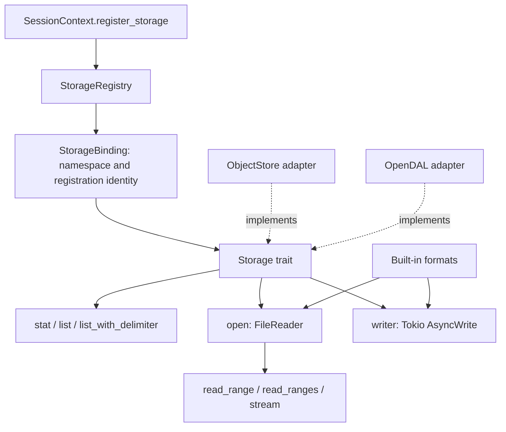

<!--
Licensed to the Apache Software Foundation (ASF) under one
or more contributor license agreements.  See the NOTICE file
distributed with this work for additional information
regarding copyright ownership.  The ASF licenses this file
to you under the Apache License, Version 2.0 (the
"License"); you may not use this file except in compliance
with the License.  You may obtain a copy of the License at

  http://www.apache.org/licenses/LICENSE-2.0

Unless required by applicable law or agreed to in writing,
software distributed under the License is distributed on an
"AS IS" BASIS, WITHOUT WARRANTIES OR CONDITIONS OF ANY
KIND, either express or implied.  See the License for the
specific language governing permissions and limitations
under the License.
-->

# DataFusion Storage

The file stack uses two backend-independent traits: `Storage` for a namespace's
file operations and `FileReader` for one open file. Outputs implement Tokio's
existing `AsyncWrite` trait. SDK implementations live in
`datafusion-storage-object-store` and `datafusion-storage-opendal`.

This PoC replaces the storage dependency boundary while preserving the operations
used by DataFusion's built-in formats. It explores
[issue #14854](https://github.com/apache/datafusion/issues/14854) together with the
backend opt-out in [PR #25144](https://github.com/apache/datafusion/pull/25144).

## Register once

Configure the SDK client, credentials, and middleware in the application, then
register it once:

```rust,ignore
use datafusion::prelude::*;
use datafusion::storage::OpendalStorage;
use std::sync::Arc;
use url::Url;

let ctx = SessionContext::new();
ctx.register_storage(
    &Url::parse("s3://warehouse")?,
    Arc::new(OpendalStorage::new(operator)),
)?;
let df = ctx.read_parquet("s3://warehouse/events/", ParquetReadOptions::default()).await?;
df.filter(col("id").gt(lit(10)))?.show().await?;
```

ObjectStore uses the same registration method with
`Arc::new(ObjectStoreStorage::new(store))`. The adapter crates can be used directly;
DataFusion also re-exports them under its `object_store` and `opendal` features.

The registration serves the ordinary CSV, JSON, Arrow, Avro, and Parquet APIs,
listing tables, SQL `COPY TO`, and file table `INSERT`. Output support remains
format-dependent. Sessions sharing a `RuntimeEnv` share registrations. Default
session assembly installs the local ObjectStore adapter when enabled, preserving
an existing application registration. A bare `RuntimeEnv` has an empty registry.

## Interfaces and ownership



`Storage` owns the client and its configuration. Its operations use paths relative
to that namespace. `open` creates an owned reader without requiring a preceding
HEAD or a known file size. `FileReader` keeps single-range and batched reads
separate, allowing adapters to retain native implementations of both. Suffix
reads serve Arrow IPC footers; full-file streams do not require metadata size.
Buffers retain their ownership independently of the reader.

The registry normalizes scheme, host, and port. Paths are file locations within a
namespace, not registry mounts. Plans retain their immutable binding across
replacement or deregistration. Cache keys include the binding identity. Planning
and subsequent executions receive fresh `FileAccessContext` values; backends can
use these to associate I/O with queries. Dropping a scan cancels its context and
releases its pending futures, without promising that remote work is reversed.

`FileInfo` holds path, size, modification time, ETag, and version independently of
SDK types. ETag and version remain observational metadata: the adapter does not
automatically enforce conditional reads or a snapshot. Format-specific decoding,
validation, pruning, and metadata caches remain in their existing format layers.
Custom `ParquetFileReaderFactory` implementations continue to take precedence.

`StorageParquetTable::try_new(binding, files, schema)` accepts explicit `FileInfo`
values for manifest inputs. Supplying a schema skips inference. This path does
not call listing. A read-only backend implements `open`; unsupported operations
can use the trait's default errors. SDK adapters call their backend directly and
propagate errors instead of checking capabilities or selecting fallback providers.

## Reads and writes

ObjectStore single and batched ranges call `get_range` and `get_ranges` directly.
Full, bounded, and suffix streams use the corresponding `get_opts` requests.
Delimiter listing calls `list_with_delimiter` so listing tables can skip pruned
subdirectories. Existing SDK clients and wrappers remain in the request path.

OpenDAL uses its native reader, batched fetch, and byte stream APIs. Its reader
accepts offset ranges, so the adapter resolves file size when a suffix read needs
it, using observed reader metadata when available. Other reads do not acquire a
size solely to satisfy the DataFusion interface.

Writers return `Box<dyn AsyncWrite + Send + Unpin>` to existing encoders and
compression wrappers. `shutdown` completes the output through the backend.
`WriterOptions.buffer_size` is passed to ObjectStore's `BufWriter` capacity or
OpenDAL's writer chunk configuration. There is no additional universal output
buffer, conditional-create mode, output metadata lookup, or abort state machine.
Failure and drop retain the underlying writer's cleanup behavior.

## Dependency boundary

The storage contract has no SDK dependency. Execution, listing, and file-format
crates depend on this contract. Each adapter depends on the contract and its own
SDK; neither depends on the other adapter. Backend features only control adapter
re-exports and default assembly, not individual file operations.

For example, `default-features = false, features = ["sql", "parquet", "avro", "opendal"]`
retains the selected file formats without a normal ObjectStore dependency.
SDK-based test fixtures can still introduce development dependencies.

`register_storage` replaces `register_object_store`. There is one registry and
one set of ordinary format entry points. Public file metadata and paths no longer
use SDK types. Custom formats and reader factories receive `StorageBinding` and
DataFusion file types.

## Limits and validation

Avro and sequential Arrow IPC paths buffer full inputs, including local files.
This is the accepted consequence of removing the local SDK payload branch in
this PoC; other streaming formats keep incremental decoding. CPU `Bytes` do not
imply GPU memory or zero-copy guarantees. Cloud service behavior requires
service-specific validation.

Adapter tests cover ordinary writes, single/batched/suffix reads, streams,
recursive and delimiter listing, and metadata preservation. Integration tests
cover the normal format APIs, COPY, INSERT, manifest inputs, binding replacement,
custom Parquet factories, and query context lifetimes. Dependency checks ensure
that the OpenDAL-only file stack does not pull in ObjectStore.

```sh
cargo test -p datafusion-storage -p datafusion-storage-object-store -p datafusion-storage-opendal
cargo test -p datafusion --no-default-features --features sql,parquet,avro,opendal --test storage
cargo tree -p datafusion --no-default-features --features sql,parquet,avro,opendal --edges normal
cargo clippy --workspace --all-features --all-targets -- -D warnings
```
