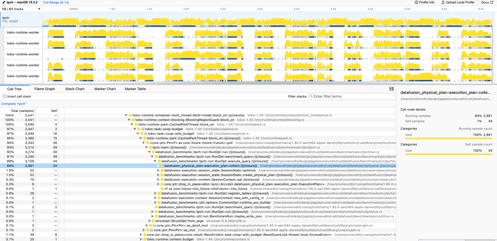

<!---
  Licensed to the Apache Software Foundation (ASF) under one
  or more contributor license agreements.  See the NOTICE file
  distributed with this work for additional information
  regarding copyright ownership.  The ASF licenses this file
  to you under the Apache License, Version 2.0 (the
  "License"); you may not use this file except in compliance
  with the License.  You may obtain a copy of the License at

    http://www.apache.org/licenses/LICENSE-2.0

  Unless required by applicable law or agreed to in writing,
  software distributed under the License is distributed on an
  "AS IS" BASIS, WITHOUT WARRANTIES OR CONDITIONS OF ANY
  KIND, either express or implied.  See the License for the
  specific language governing permissions and limitations
  under the License.
-->

# Profiling Cookbook

The section contains examples how to perform CPU profiling for Apache DataFusion on different operating systems.

## Building a flame graph

[Video: how to CPU profile DataFusion with a Flamegraph](https://youtu.be/2z11xtYw_xs)

A flamegraph is a visual representation of which functions are being run
You can create flamegraphs in many ways; The instructions below are for
[cargo-flamegraph](https://github.com/flamegraph-rs/flamegraph) which results
in images such as this:


## MacOS

### Step 1: Install the flamegraph Tool

To install flamegraph, run:

```shell
cargo install flamegraph
```

### Step 2: Prepare Your Environment

Ensure that you're in the directory containing the necessary data files for your DataFusion query. The flamegraph tool will profile the execution of your query against this data.

### Step 3: Running the Flamegraph Tool

To generate a flamegraph, you'll need to use the -- separator to pass arguments to the binary you're profiling. For datafusion-cli, you need to make sure to run the command with sudo permissions (especially on macOS, where DTrace requires elevated privileges).

Here is a general example:

```shell
sudo flamegraph -- datafusion-cli -f <path_to_sql_file/sql_file.sql>
```

#### Example: Generating a Flamegraph for a Specific Query

Here is an example using `28.sql`:

```shell
sudo flamegraph -- datafusion-cli -f 28.sql
```

You can also invoke the flamegraph tool with `cargo` to profile a specific test or benchmark.

#### Example: Flamegraph for a specific test:

```bash
CARGO_PROFILE_RELEASE_DEBUG=true cargo flamegraph --root --unit-test datafusion  -- dataframe::tests::test_array_agg
```

#### Example: Flamegraph for a benchmark

```bash
CARGO_PROFILE_RELEASE_DEBUG=true cargo flamegraph --root --bench sql_planner -- --bench
```

### CPU profiling with XCode Instruments

[Video: how to CPU profile DataFusion with XCode Instruments](https://youtu.be/P3dXH61Kr5U)

## Profiling using Samply cross platform profiler

There is an opportunity to build flamegraphs, call trees and stack charts on any platform using
[Samply](https://github.com/mstange/samply)

Install Samply profiler

```shell
cargo install --locked samply
```

More Samply [installation options](https://github.com/mstange/samply?tab=readme-ov-file#installation)

Run the profiler

```shell
samply record --profile profiling ./my-application my-arguments
```

### Profile the benchmark

[Set up benchmarks](https://github.com/apache/datafusion/blob/main/benchmarks/README.md#running-the-benchmarks) if not yet done

Example: Profile Q22 query from TPC-H benchmark.
Note: `--profile profiling` to profile release optimized artifact with debug symbols

```shell
cargo build --profile profiling --bin tpch
samply record ./target/profiling/tpch benchmark datafusion --iterations 5 --path datafusion/benchmarks/data/tpch_sf10 --prefer_hash_join true --format parquet -o datafusion/benchmarks/results/dev2/tpch_sf10.json --query 22
```

After sampling has completed the Samply starts a local server and navigates to the profiler

```shell
Local server listening at http://127.0.0.1:3000
```



Note: The Firefox profiler cannot be opened in Safari, please use Chrome or Firefox instead
